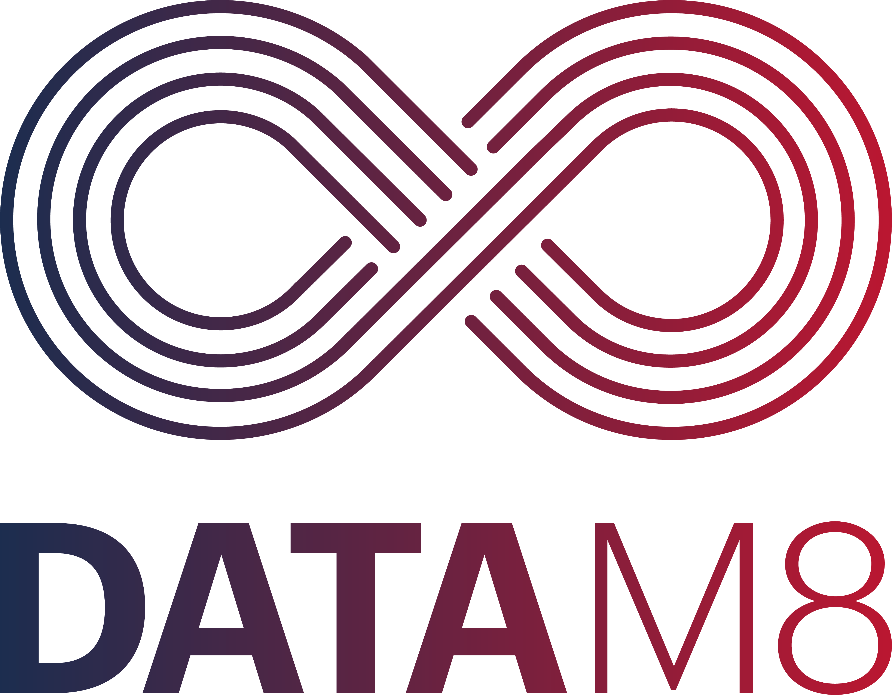

# ORAYLIS _DataM8_

Welcome to the comprehensive documentation for _DataM8_, a powerful solution developed by ORAYLIS GmbH for managing and maintaining projects for target data warehouses. This documentation will provide you with an in-depth understanding of the components of _DataM8_, the solution structure, and how to effectively work with generators.

## Main Components of _DataM8_

_DataM8_ is composed of the following components:

- [Frontend:](docs/frontend/README.md) The _DataM8_ frontend is a user-friendly application that allows you to manage and maintain your data warehouse project efficiently. It provides an intuitive interface for working with the data model and generating target artifacts.

- [Generator (CLI):](docs/generator/README.md) The _DataM8_ generator is a command-line interface (CLI) tool that empowers you to generate a wide range of target artifacts for your data warehouse. This includes code templates, queries, and other components necessary for your project.

- [Validator (CLI):](docs/validator.md) The _DataM8_ validator is a command-line interface (CLI) tool that helps ensure the integrity and validity of your data model. It performs checks and validations to ensure that your data model is consistent and error-free.

### Repositories
* model: https://github.com/oraylis/datam8-model
* generator: https://github.com/oraylis/datam8-generator
* frontend: https://github.com/oraylis/datam8-frontend
* sample solution: https://github.com/oraylis/datam8-sample-solution

## _DataM8_ Solution Structure

_DataM8_ follows a well-defined solution structure to organize and manage your data warehouse project efficiently.

The solution structure is as follows:

```console
|   datam8.user
|   index.json
|   SolutionName.dm8s
|
+---Base
|       AttributeTypes.json
|       DataProducts.json
|       DataSources.json
|       DataTypes.json
|
+---Raw
|   \---DataProduct
|       +---DataModule
|               Entity.json
|
+---Staging
|   \---DataProduct
|       +---DataModule
|               Entity.json
|
+---Core
    \---DataProduct
        +---DataModule
               Entity.json
```

- **datam8.user:** This file contains user-specific settings for the _DataM8_ frontend. You can customize your preferences and configurations here.

- **index.json:** The index file enhances the performance of metadata operations when working with the serialized JSON data model. It allows for quick and efficient access to specific metadata artifacts.

- **SolutionName.dm8s:** This file is essential for the _DataM8_ frontend, validator and generator as it serves as a reference to the entire JSON metadata model of the solution. You can use it to access and manipulate the metadata.

The solution structure is designed to handle different stages/zones of data processing, including Base, Raw, Staging, and Core, each containing DataProduct folders, which, in turn, have modules with their respective .json files representing specific entities in the data model.

## _DataM8_ Metadata Model

Details on the metadata model can be found in this 📜[guide](docs/metadatamodel.md).

## Quick Start Guide

A comprehensive quick start for _DataM8_ can be found in this 📜[guide](docs/quickstart.md).

## Contribution Guide

To contribute to _DataM8_, follow this contribution and branching 📜[guide](docs/contribution.md).

The security guidelines can be found here 🔐[security](docs/security_guidelines.md).

## Conclusion

With this comprehensive documentation, you should have a clear understanding of _DataM8_, its components, the solution structure, and how to work with generators. You are now equipped to effectively manage and maintain your data warehouse project using _DataM8_.

If you have any questions or need further assistance, please feel free to reach out to us.

**Happy data managing with _DataM8_!**
