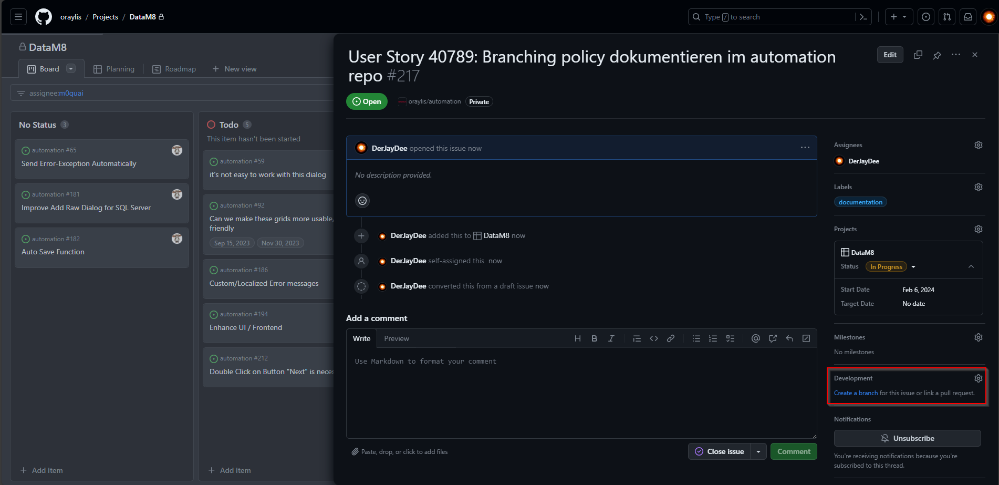
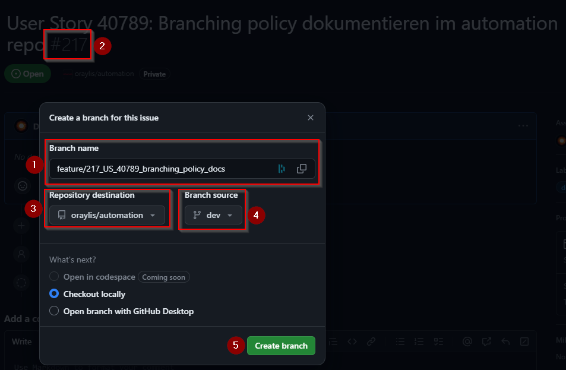
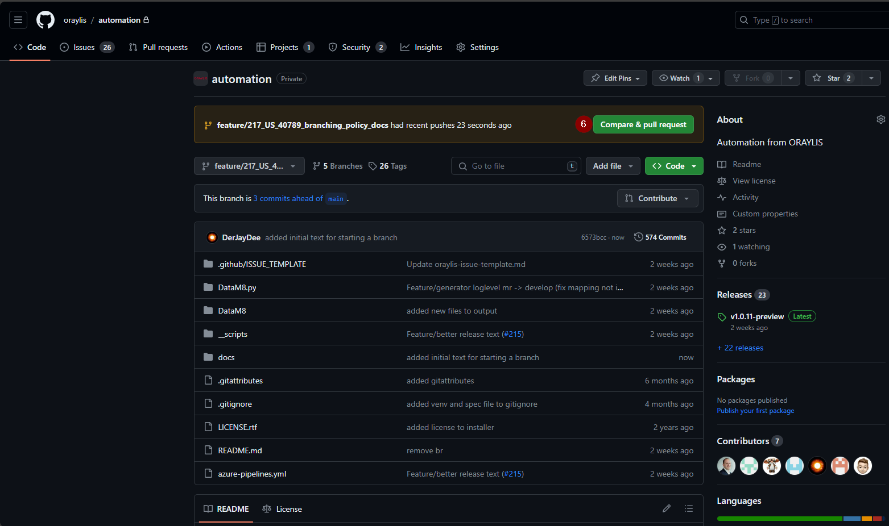
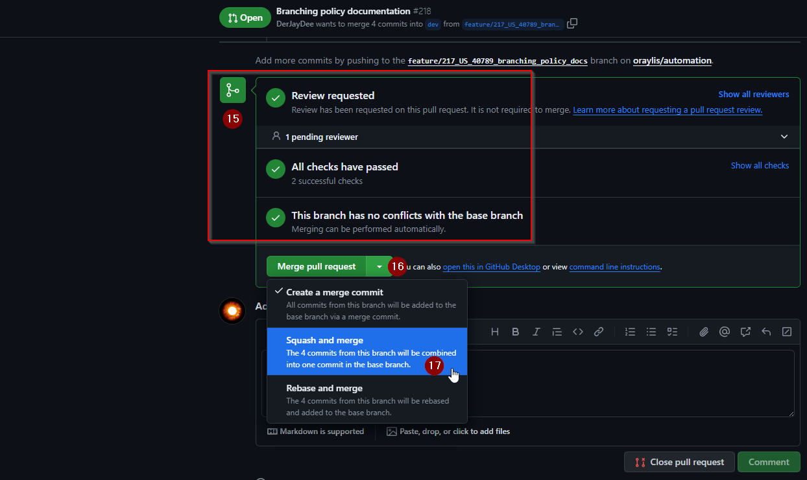
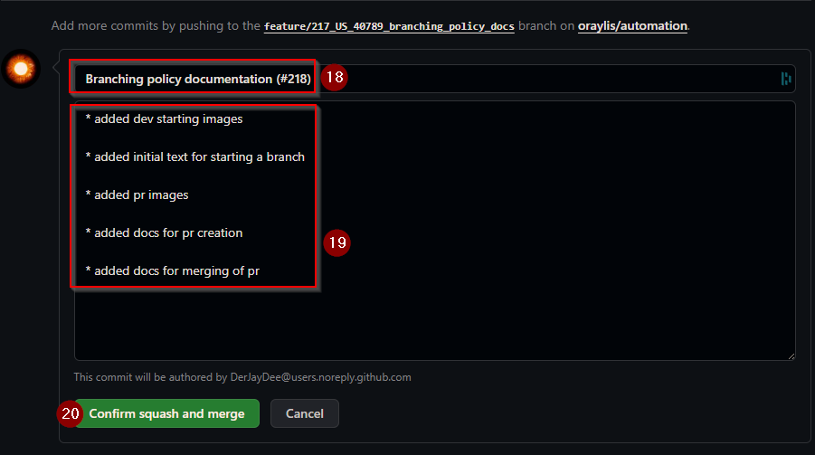

# Contribution

## Branching

When contributing to this repository, there are some workflows to respect. For working with GIT and the branching strategy there is a workflow with a strong influence from GitFlow.

To start your work, you sall create a branch from within the issue that you want to work on:

Branch names (1) for regular development shall always start with "feature/" followed by the issue number (2).
Make sure to have the correct repository selected (3) and make sure to branch off from the "dev" branch (4). Hit the button to create the branch (5).

Check out your newly created branch to your working environment and implement the feature.
It is a good practice to make small commits with meaningful commit messages. You shall also commit, when you completed a sub-task to your feature.

When you completed and tested your work, make sure to have everything committed and pushed back to GitHub. Within GitHub you will get a prompt, that you can create a pull request. Hit that button (6).

While creating the pull request make sure, that:

- You selected "dev" as the target branch (7).
- You add a meaningful title to the pull request (8).
- You add a proper description (9). Usage of the keyword "closing" followed by an issue number automatically closes the issue upon completion of the pull request.
- You added apropriate reviewers (10).
- You added assignees to the pull request that shall work on comments made by the reviewer (11).
- You add fitting labels to the pull request (12).
- You select the project to what the pull request contributes (13).
Then, create the pull request (14).

When you resolved all comments from your reviewers and your development has passed all checks (15), you can continue to merge. To do do so, select the drop down (16) and select "Squash and merge" (17).

When you now hit the "Squash and merge" button, you get displayed with a dialog to specify the squash merge commit title (18) as well as the description (19) to it.
Title will get auto-filled with the pull request title and the number appended to it.
Description will get auto-filled with all commit messages on the feature branch.
It is up to you to generate a meaningful title and description that is suitable for a change log.
When all is entered well, hit "Confirm squash and merge" (20) to complete the pull request.

