# _DataM8_ Frontend [Core Group](../frontend.md#core-group)

Within the [Core Group](../frontend.md#core-group), _DataM8_ allows you to add [core](../../metadatamodel/zones/core.md#entity-definition) entities to the metadata model based on stage entities and allows simple business transformations.

## Adding core entities

### Add [core](../../metadatamodel/zones/core.md#entity-definition)

To add a [core](../../metadatamodel/zones/core.md#entity-definition) entity, use the following interface:

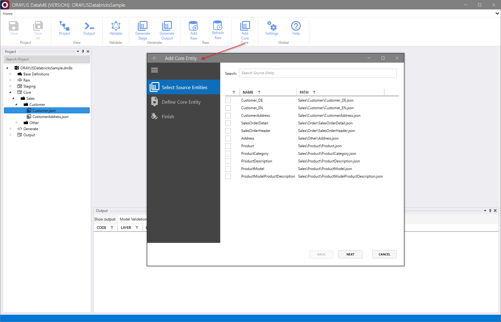

Afterwards, select a single entity or multiple entities that have to be unioned from the [stage](../../metadatamodel/zones/stage.md#entity-definition) as a source into a single entity in core:

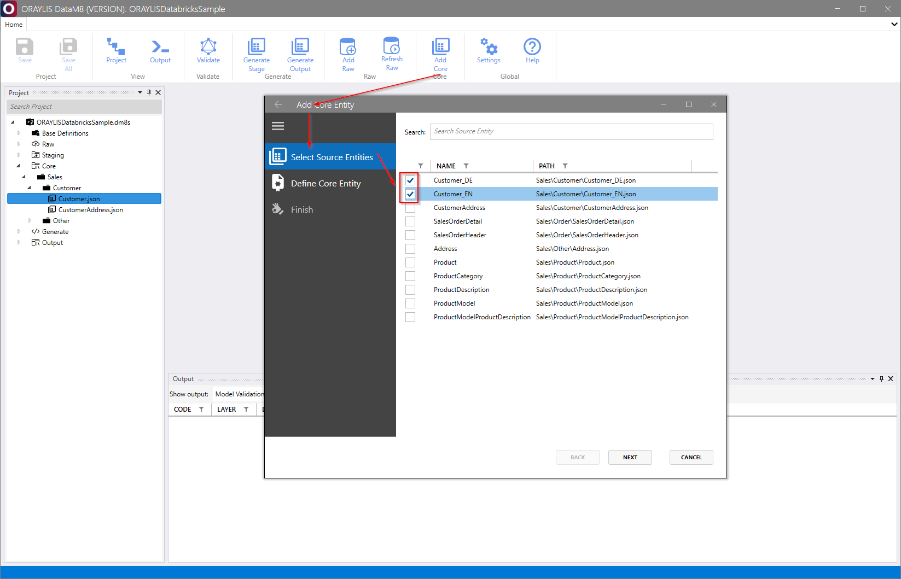

This is followed by a definition of the [core](../../metadatamodel/zones/core.md#entity-definition) entity. Ensure that all five fields are filled (select a data product, data module as per [base definitions](../../metadatamodel/metadatamodel.md#base-definitions) plus a display name and eventually adapt the path!):

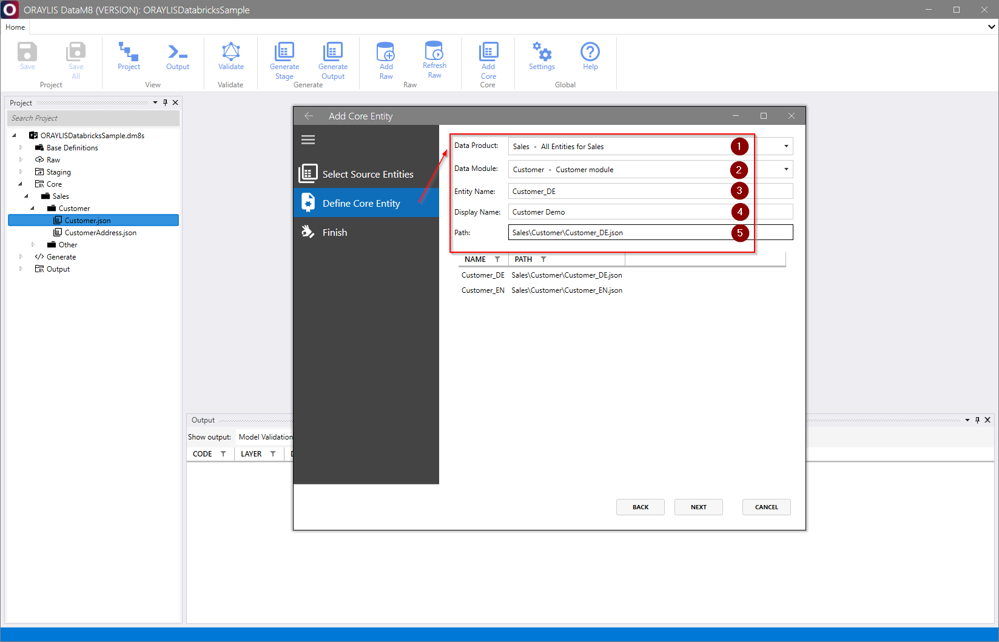

## Understanding the capabilities of the [core](../../metadatamodel/zones/core.md#entity-definition) dialogues

_DataM8_ offers a dialogue to do the main data modeling tasks and to set up simple business transformations. 

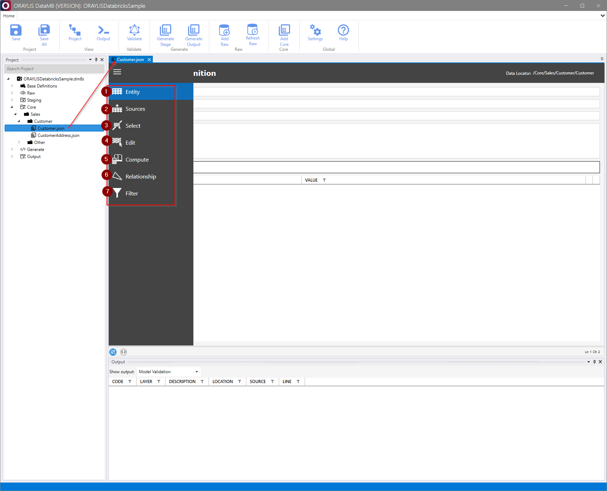

It involves the following seven essential modeling steps:

### 1. Entity

Allows editing the [core](../../metadatamodel/zones/core.md#entity-definition) entity definition by six modeling areas:

1. **Entity Name** of the entity
2. **Display Name** used, e.g., in documentation
3. **Explanation** of the business terms on what the entity describes used, e.g., in documentation
4. **Purpose** on why the entity is needed used, e.g., in documentation
5. **Tags** to, e.g., cluster the entity for special handling by the [generator](../generator/generator.md)
6. **Parameters** as a key-value store that can be consumed by the [generator](../generator/generator.md)

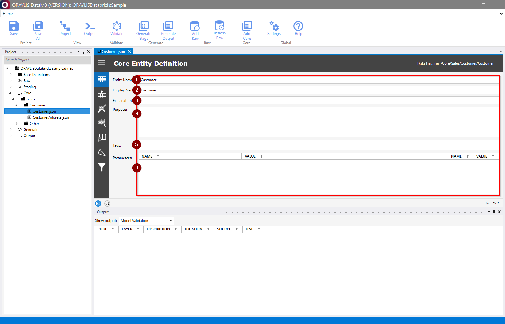

### 2. Sources

Two modeling steps:

1. **Add** or remove a source entity from the [stage](../../metadatamodel/zones/stage.md#entity-definition) zone
2. **Add** a filter criterion to filter the incoming [stage](../../metadatamodel/zones/stage.md#entity-definition) entity (e.g., CustomerCountry = 'DE')

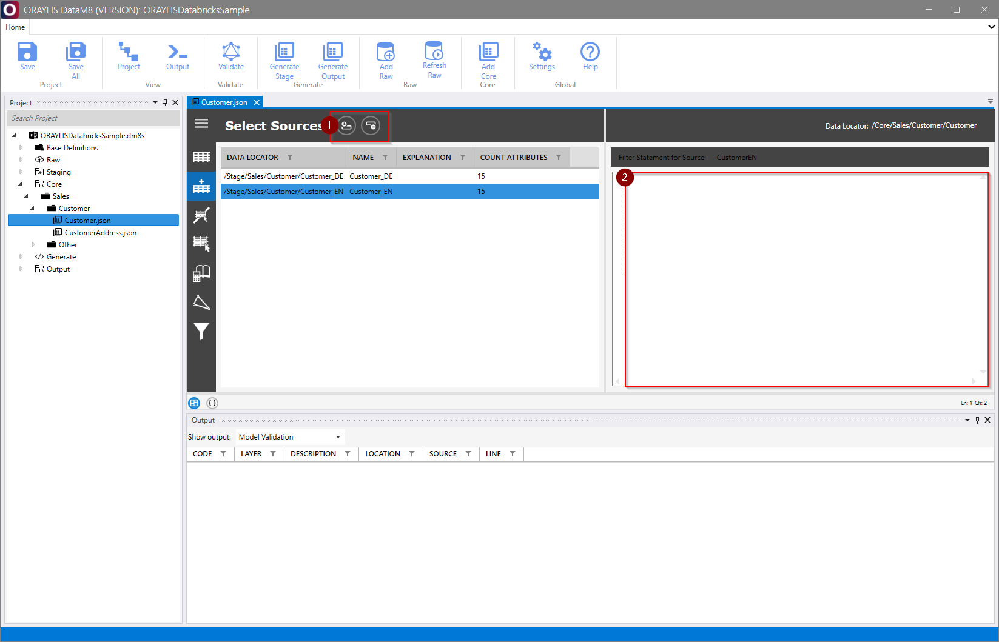

### 3. Select

Include or exclude certain columns from the [core](../../metadatamodel/zones/core.md#entity-definition) entity (left side: included, right side: excluded):

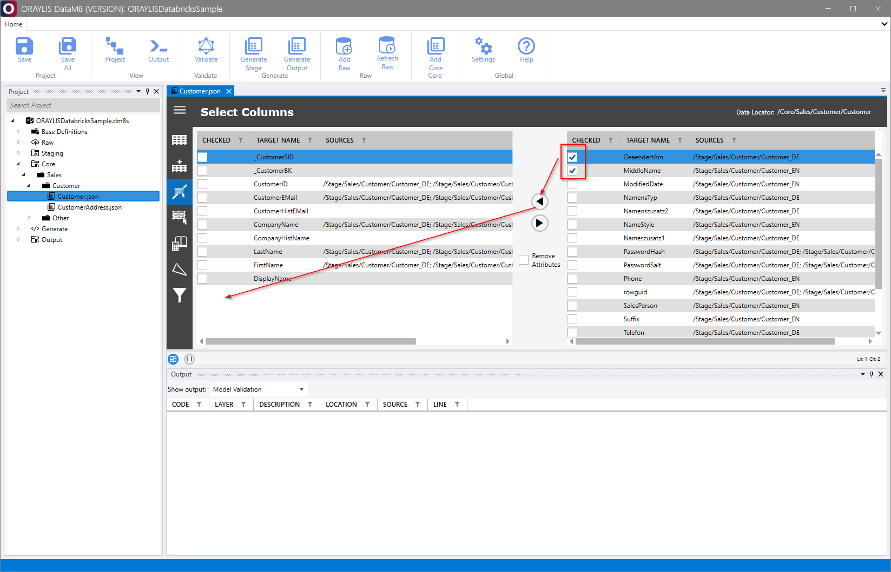

### 4. Edit

12 modeling steps to edit the final column definition in the [core](../../metadatamodel/zones/core.md#entity-definition) entity:

1. **Quick editor** for the column in non-cellular format to quickly perform the following modeling steps. Click on the symbol. 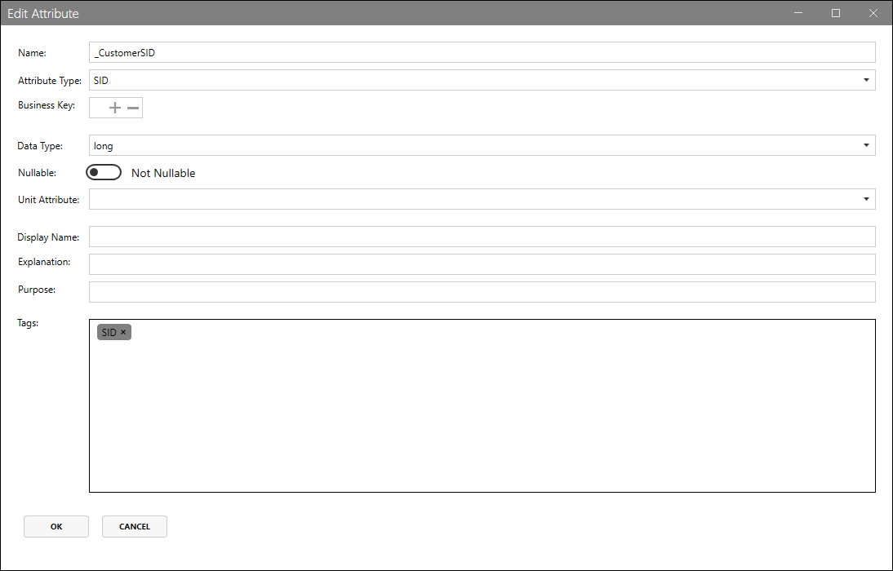
2. **Target Name** to define the target name of the column
3. **Assign/Union Attributes** from the source to this target column. Click on the symbol. Multiple columns can be selected in the case of union 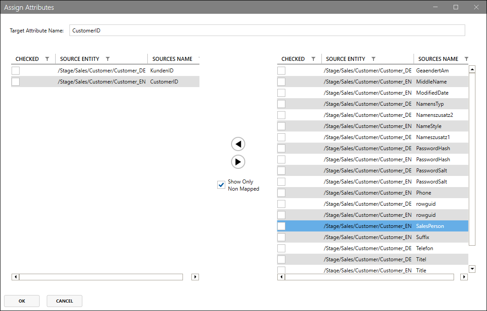
4. **Business Key Number** to be set for business key(s). Multiple numbers apply for composite keys.
5. **Attribute type** from [base definitions](../../metadatamodel/metadatamodel.md#base-definitions) to be set a data type with business meaning that can be used for e.g. validation or to add it via [generator](../generator/generator.md) to the column name to indicate the contents of a column
6. **Data Type** from [base definitions](../../metadatamodel/metadatamodel.md#base-definitions) for the technical target data type
7. **Unit Attribute Name** If this column is a numeric value, this dropdown can be used to assign a relation to a foreign column in this entity containing the corresponding unit of measure (e.g. Unit column that indicates kg, grams, lb, etc.)
8. **Source Entities** as a result of previous steps or the **Assign/Union Attributes** quick editor from step 3. displayed via [DataM8 Locator](../../metadatamodel/metadatamodel.md).
9. **Mappings** as a result of previous steps or the **Assign/Union Attributes** quick editor from step 3. [DEFAULT] indicates a missing assignment, e.g. a generated column.
10. **Tags** that can be set add simple business transformation logic, key definitions or SCD handling.
11. **Add** a new, unassigned column, e.g., to create a computed column afterwards or to fill it with real data from a [stage](../../metadatamodel/zones/stage.md#entity-definition) column
12. **Auto Sort** the columns

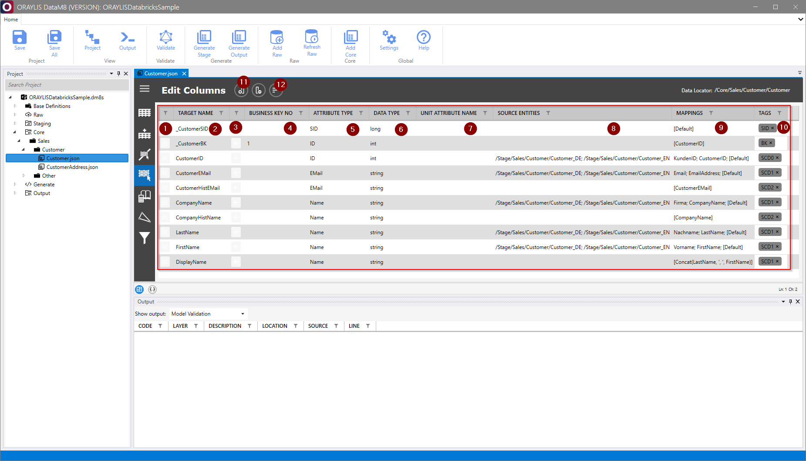

### 5. Compute

Select, e.g., an unassigned column and add an SQL function to compute it:

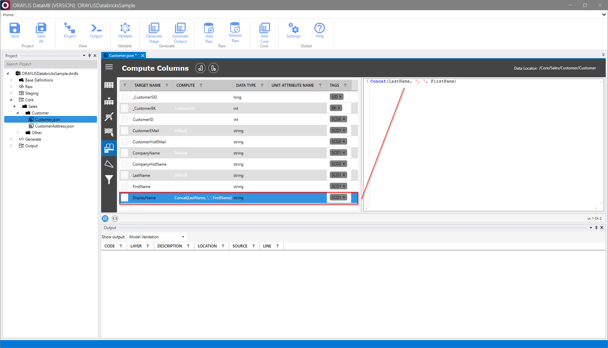

### 6. Relationship

This step can be useful for generated data models with computed relationship columns and keys (e.g., Data Vault 2.0) or for documentation purposes. If all business keys are correctly set, this dialogue allows you to select a foreign entity from the [core](../../metadatamodel/zones/core.md#entity-definition) zone and to add a relationship based on the business keys (incl. support for composite keys):

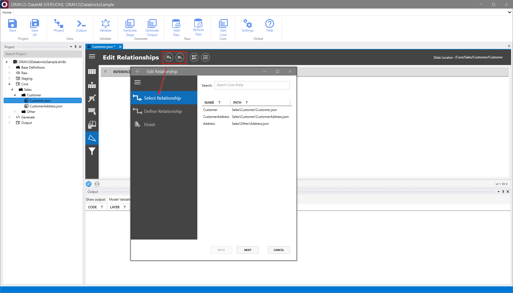

### 7. Filter

As a last step, the complete entity can be filtered using an SQL function (e.g., ComputedCustomerCountry = 'DE')

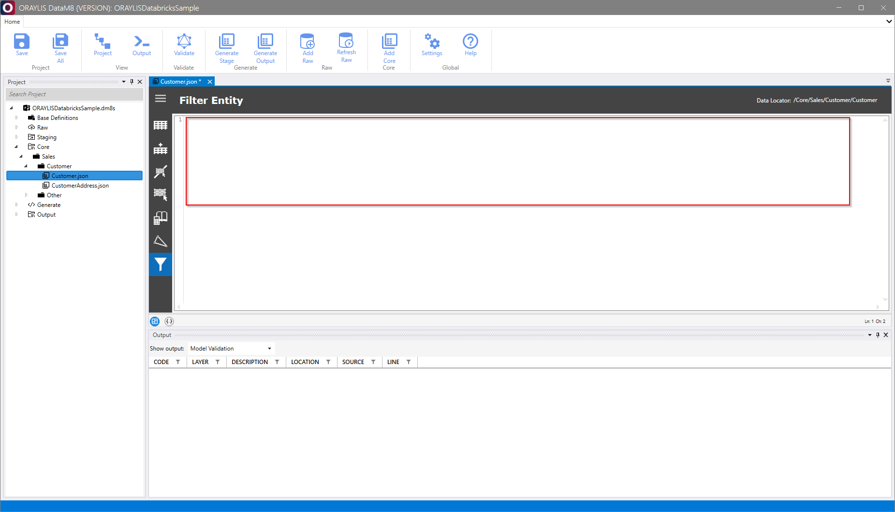
