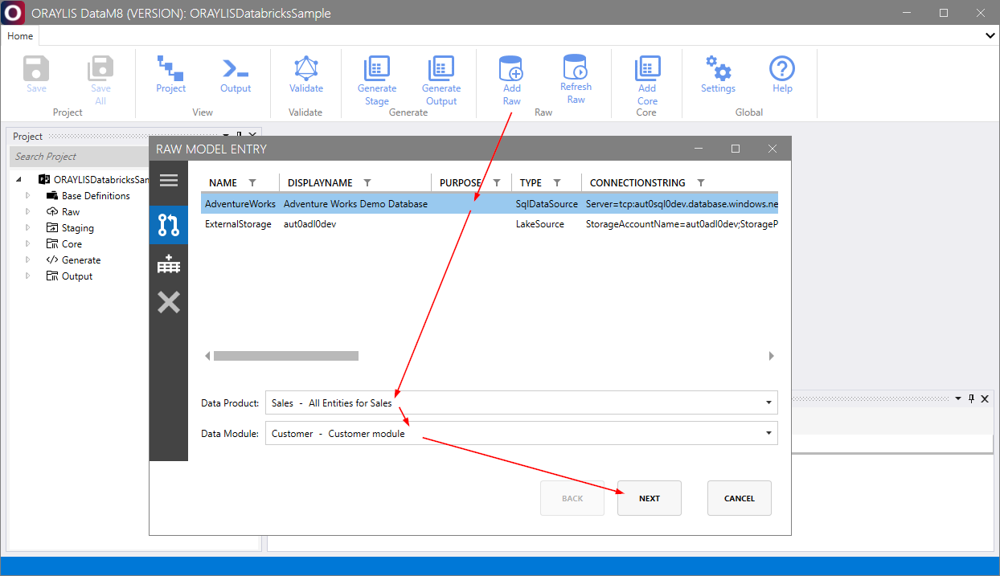

# _DataM8_ Frontend [Raw Group](../frontend.md#raw-group)

Within the [Raw Group](../frontend.md#raw-group), _DataM8_ allows you to add [raw](../../metadatamodel/zones/raw.md#entity-definition) entities to the metadata model from data sources using a dialogue that functions as a reverse generator, or to refresh [raw](../metadatamodel/zones/raw.md) entities within the metadata model using fresh metadata from sources.

## Working with raw entities

### Add [raw](../../metadatamodel/zones/raw.md#entity-definition)

To add a [raw](../../metadatamodel/zones/raw.md#entity-definition) entity, use the following interface:

## Refresh raw

To refresh the [raw](../../metadatamodel/zones/raw.md) zone with fresh metadata, select [Refresh Raw](../frontend.md#refresh-raw) from the [Raw Group](../frontend.md#raw-group):

### Select the data source to add new entities to the [raw](../../metadatamodel/zones/raw.md) zone

### Select the entities to be refreshed from [raw](../../metadatamodel/zones/raw.md) zone

