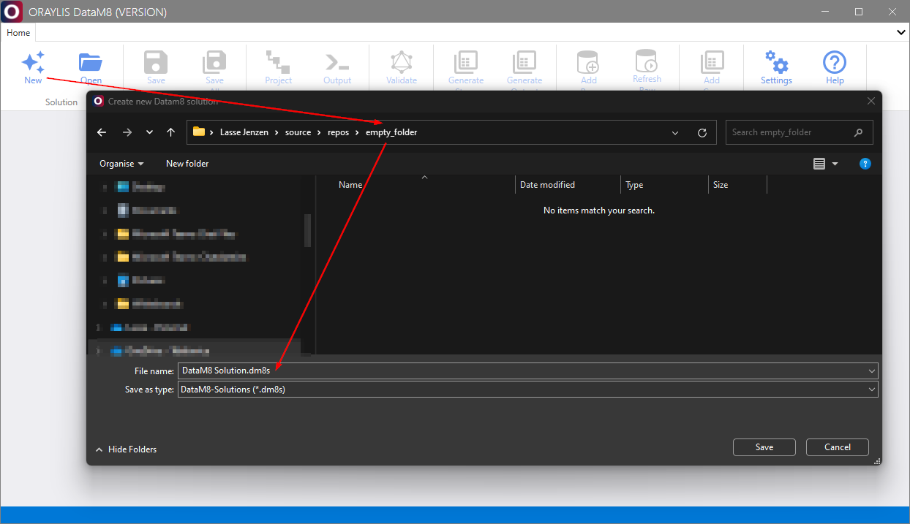
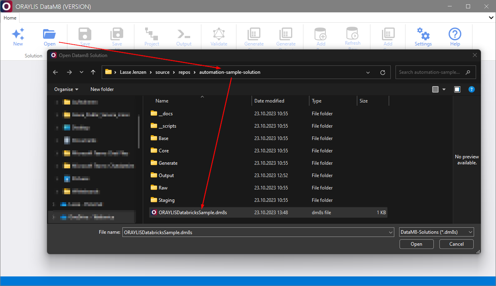
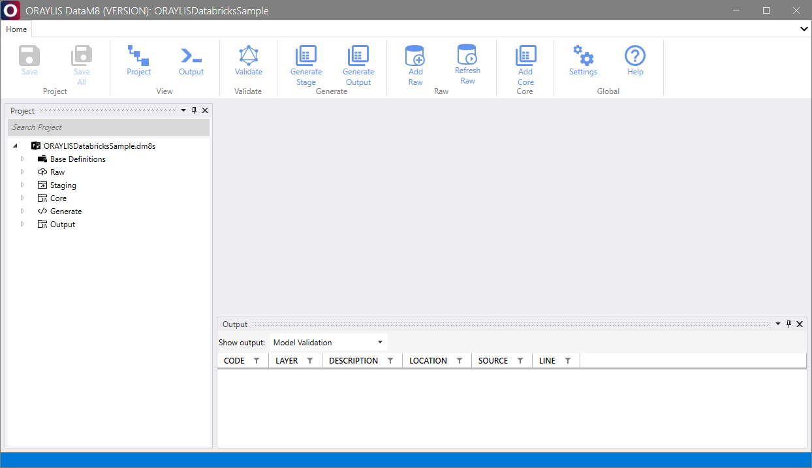

# _DataM8_ Frontend [Solution Group](../frontend.md#solution-group)

Within the [Solution Group](../frontend.md#solution-group), _DataM8_ allows you to either create a new, empty _DataM8_ solution or access an existing _DataM8_ solution file (.dm8s) as defined in [DataM8](../DataM8.md).

## Create a new _DataM8_ solution (.dm8s)

To create a new _DataM8_ solution, follow these steps:

1. Click on [New](../frontend.md#new) in the [Solution Group](../frontend.md#solution-group).
2. Choose a desired folder and select the .dm8s solution file name representing the project name.

## Opening an existing _DataM8_ solution (.dm8s)

To open an existing _DataM8_ solution, perform the following steps:

1. Click on [Open](../frontend.md#open) in the [Solution Group](../frontend.md#solution-group).
2. Select the .dm8s solution file of an existing solution.

## Working with a _DataM8_ solution

When working with a _DataM8_ solution, the frontend interface appears as shown below:

