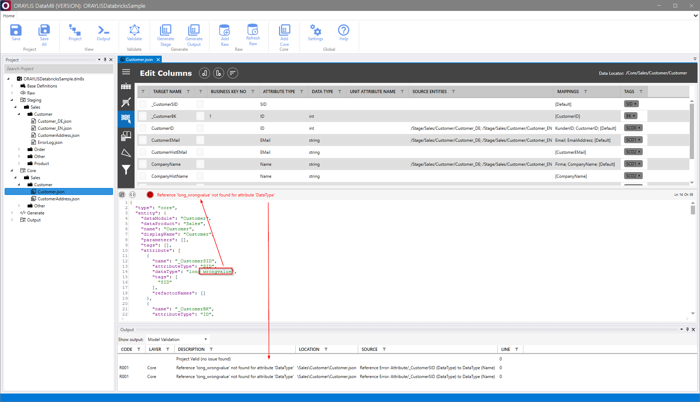
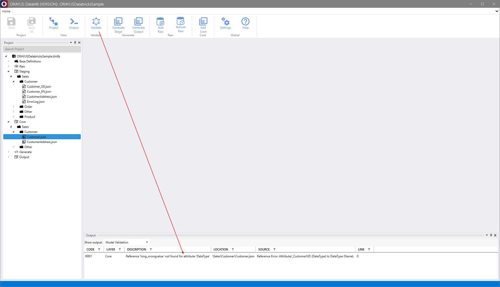
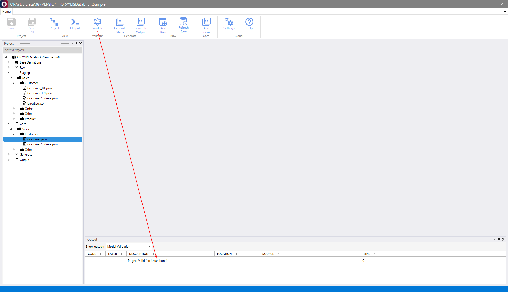

# _DataM8_ Frontend [Validate Group](../frontend.md#validate-group)

Within the [Validate Group](../frontend.md#validate-group), _DataM8_ allows you to check the entire data model using the built-in [validator](../../validator/validator.md) and print results into the output.

## Validating the Metadata Model

### Automatic Validation

In the general workflow, _DataM8_ automatically checks the metadata model when editing an entity either within or outside the _DataM8_ environment. It identifies and highlights errors if the metadata model does not conform to the defined _DataM8_ schema. An example of automatic validation is demonstrated in the image below:

## Manual Validation of the Entire Data Model

Within the _DataM8_ Frontend, you can manually trigger the validator by selecting the [Validate](../frontend.md#validate) option within the [Validate Group](../frontend.md#validate-group). This is particularly useful when you want to proactively ensure the accuracy and integrity of your data model.

Upon a successful validation process with no errors, the validator will report as illustrated below:

## CLI Usage

For more advanced usage and integration with the Continuous Integration and Continuous Deployment (CI/CD) pipeline, the validator can be triggered via the [CLI](../../validator/validator.md).
