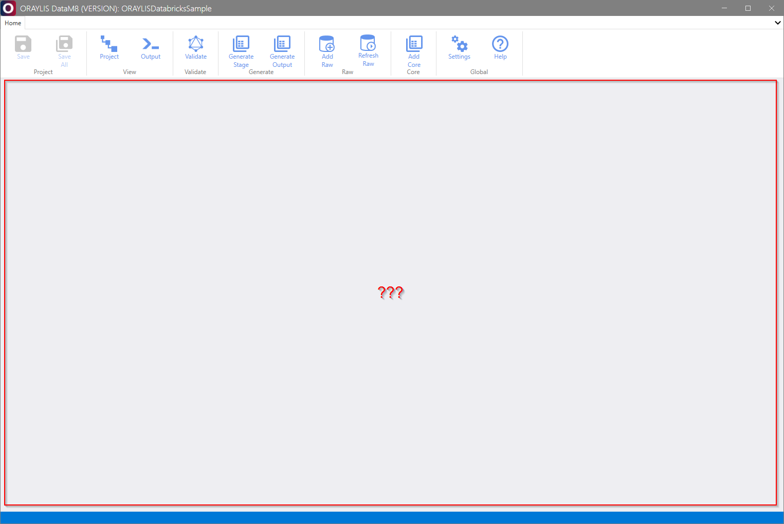
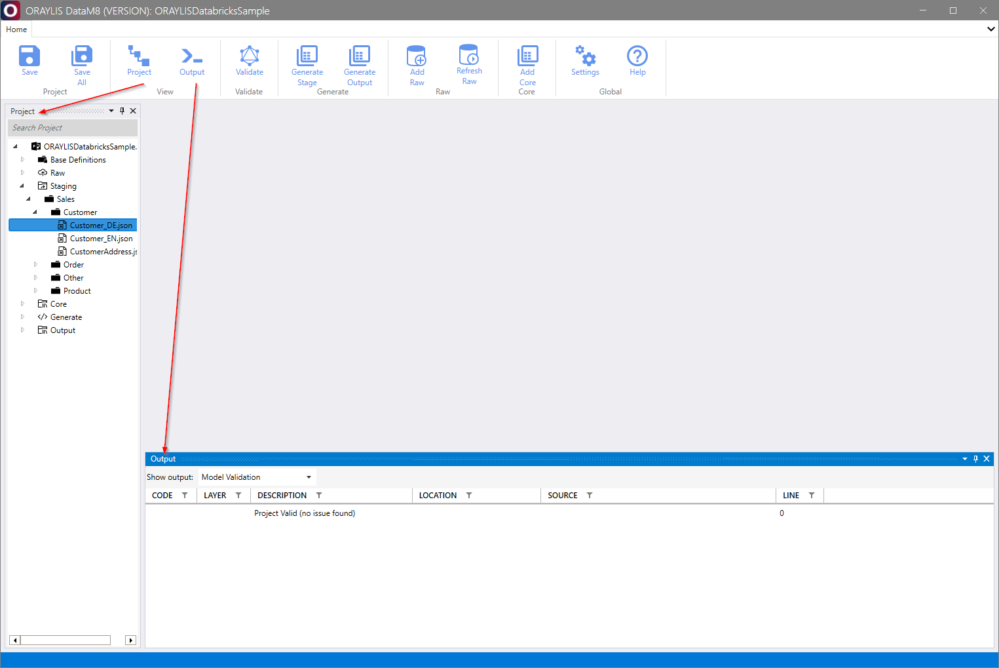
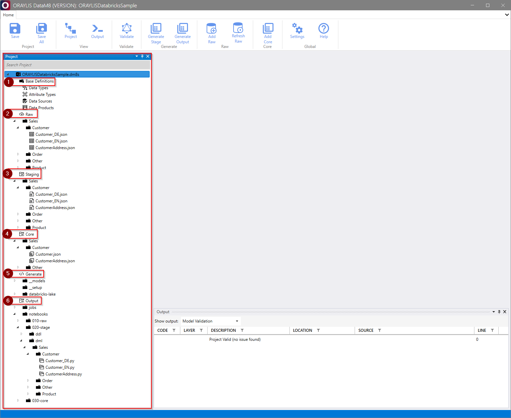
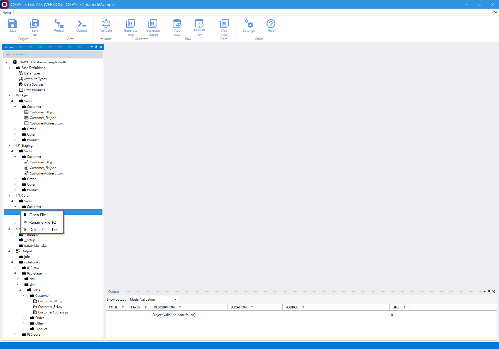
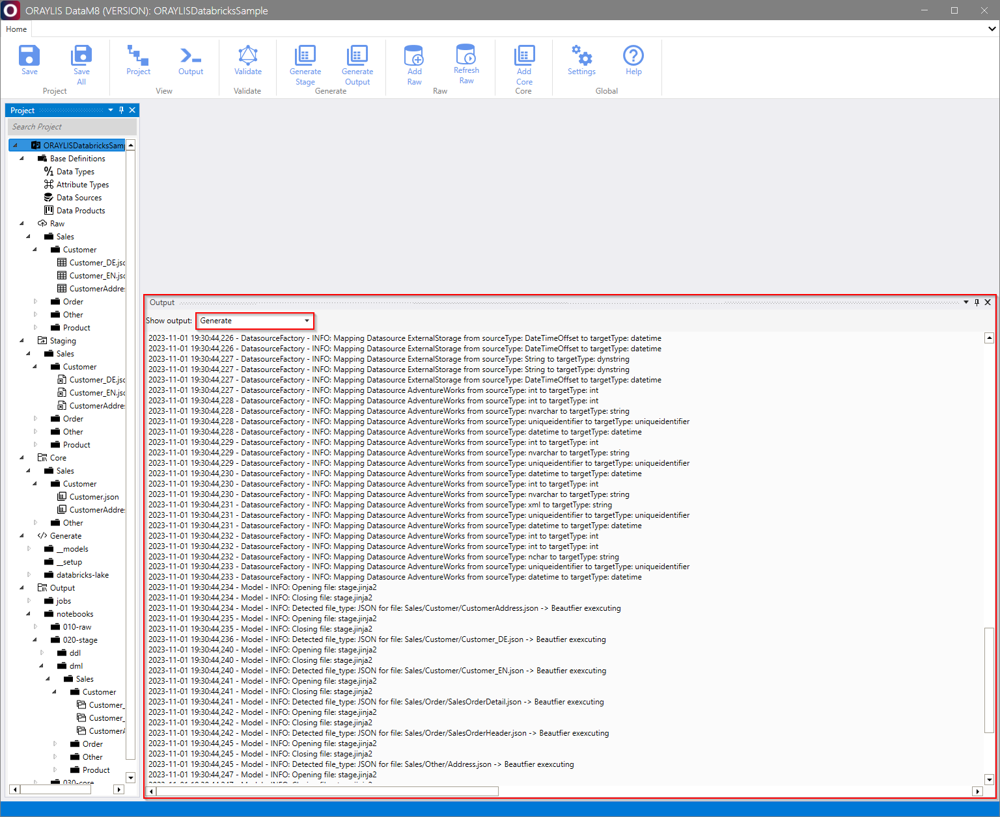
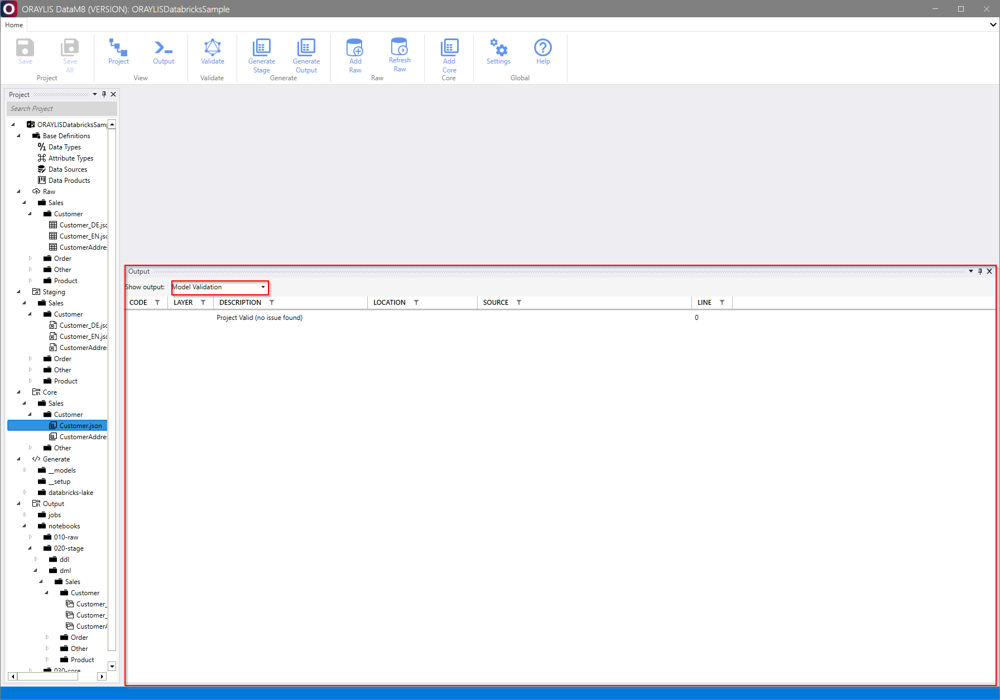

# _DataM8_ Frontend [View Group](../frontend.md#view-group)

Within the [View Group](../frontend.md#view-group), _DataM8_ allows you to either open the [project](../frontend.md#project) pane or the [output](../frontend.md#output) pane. Both panes are powerful tools to manage and control a _DataM8_ [solution](../../DataM8.md#datam8-solution-structure).

## Open panes

Once a solution is opened but no project and/or output pane is available, the [View Group](../frontend.md#view-group) becomes relevant.

Clicking on [Project](../frontend.md#project) opens the project pane, while clicking on [Output](../frontend.md#output) opens the output pane.

## Using the panes

### [Project](../frontend.md#project) pane

Within this pane, you can see the entire solution project.

The view categorizes a solution into the following components:

#### 1. [Base Definitions](../../metadatamodel/metadatamodel.md#base-definitions)

> Refers to [base definitions](../../metadatamodel/metadatamodel.md#base-definitions) of the metadata model that define data types, attribute types, data sources, or data products.

#### 2. [Raw](../../metadatamodel/zones/raw.md#entity-definition)

> Refers to the [raw](../../metadatamodel/zones/raw.md#entity-definition) zone and shows entities organized by data products and data modules as given by the base definition.

#### 3. [Staging](../../metadatamodel/zones/stage.md#entity-definition)

> Refers to the [stage](../../metadatamodel/zones/stage.md#entity-definition) zone and shows entities organized by data products and data modules as given by the base definition.

#### 4. [Core](../../metadatamodel/zones/core.md#entity-definition)

> Refers to the [core](../../metadatamodel/zones/core.md#entity-definition) zone and shows entities organized by data products and data modules as given by the base definition.

#### 5. [Generate](../../generator/generator.md)

> Organizes the Jinja2 templates as input for the generator that can be used to either [Generate Stage](../frontend.md#generate-stage) or [Generate Output](../frontend.md#generate-output).

#### 6. Output

> Reflects the output being generated by the [generator](../../generator/generator.md).

The above is structured as shown below.

In this pane, a dynamic context menu allows you to dynamically open, rename, or delete a file/entity.

### [Output](../frontend.md#output) pane

Open the output pane, which displays logs from either the [generator](../../generator/generator.md) or the [validator](../../validator/validator.md).

#### [Generator](../../generator/generator.md) logs

#### [Validator](../../validator/validator.md) logs

