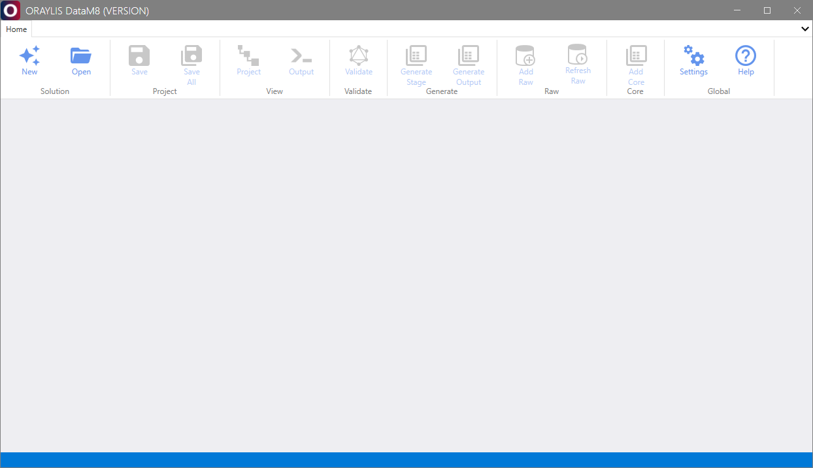
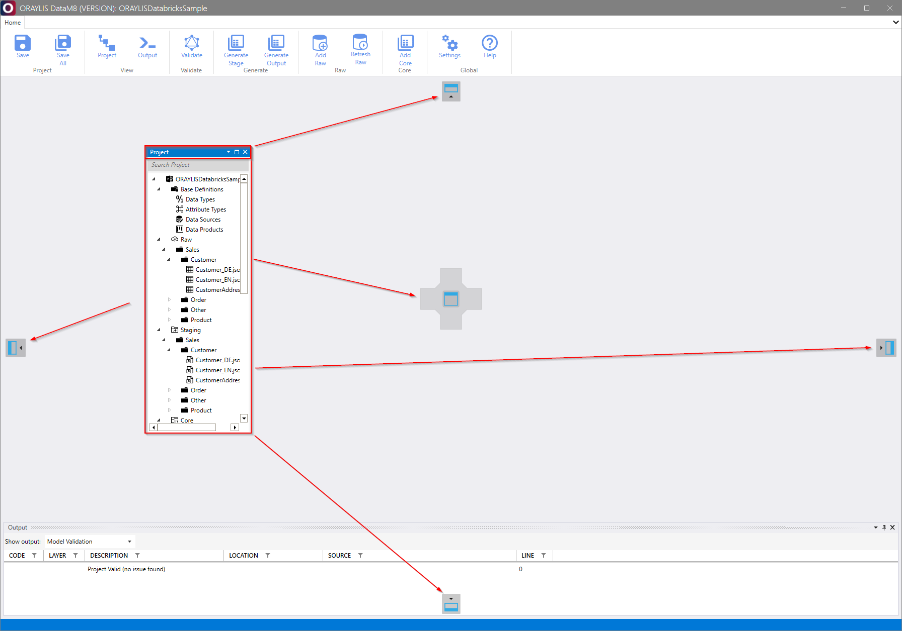
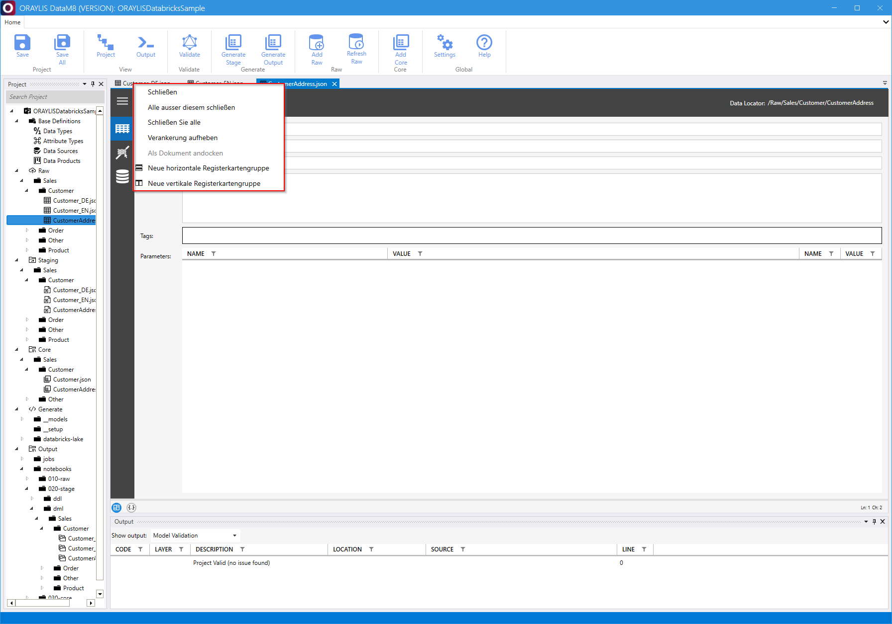
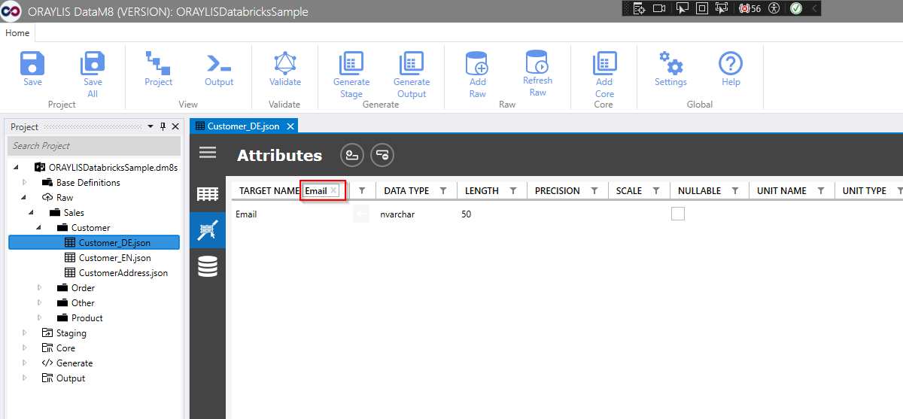

# _DataM8_ Frontend

_DataM8_ offers a user-friendly frontend that simplifies the process of adding, editing, or generating based on the JSON metadata model.

## Basic Features of the Frontend

Upon launching the application, the frontend interface appears as follows.

As _DataM8_ makes use of the WPF Framework, it allows you to easily dock a pane or window wherever needed within the frontend.

Additional context menus for panes open on right-click to quickly rearrange or selectively close panes. 

In a further feature, the frontend offers a search function at attribute level for all tabular views. This allows objects to be found fast and easily.

The frontend provides the following essential functionalities:

### Solution Group

Follow this 📜[guide](dialogues/group-solution.md).

#### New

Create a new, empty _DataM8_ solution defined as in [DataM8](../DataM8.md).

#### Open

Access an existing _DataM8_ solution file (.dm8s) defined as in [DataM8](../DataM8.md).

### Project Group

#### Save

Save the currently opened object.

#### Save All

Save all objects.

### View Group

Follow this 📜[guide](dialogues/group-view.md).

#### Project

Open the project view pane to review the entire solution project.

#### Output

Open the output view pane, which displays output from the [generator](../generator/generator.md) and the [validator](../validator/validator.md).

### Validate Group

Follow this 📜[guide](dialogues/group-validate.md).

#### Validate

Check the entire data model using the [validator](../validator/validator.md) and print results into the output. This is particularly useful for ensuring the accuracy and integrity of the data model.

### Generate Group

Follow this 📜[guide](dialogues/group-generate.md).

#### Generate Stage

Generate the [stage](../metadatamodel/zones/stage.md) zone using a data model transformation template with the [generator](../generator/generator.md) and print results into the output. This feature aids in the transformation and processing of the data model.

#### Generate Output

Generate the final artifacts of target data warehouses using an output transformation template with the [generator](../generator/generator.md) and print results into the output. This facilitates the creation of the final data warehouse artifacts.

### Raw Group

Follow this 📜[guide](dialogues/group-raw.md).

#### Add Raw

Add [raw](../metadatamodel/zones/raw.md) entities to the metadata model from data sources using a dialogue that functions as a reverse generator.

&rarr; Currently supported data sources: ADLS gen2 and SQL Server.

#### Refresh Raw

Refresh [raw](../metadatamodel/zones/raw.md) entities within the metadata model using fresh metadata from sources. This ensures the most up-to-date and accurate metadata representation.

### Core Group

Follow this 📜[guide](dialogues/group-core.md).

#### Add Core

Add a [core](../metadatamodel/zones/core.md) entity to the metadata model using a dialogue. This feature helps in the addition of core entities to the data model.

### Global Group

#### Settings

Configure baseline settings for the frontend, such as generator paths and theme. This allows for customization and fine-tuning of the frontend environment.

#### Help

Access the documentation for reference. This serves as a comprehensive guide for any queries or clarifications regarding the usage and functionalities of the _DataM8_ frontend.
