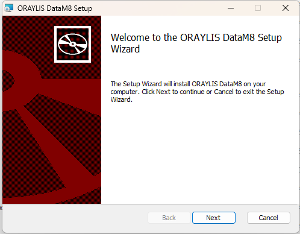
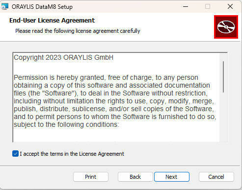
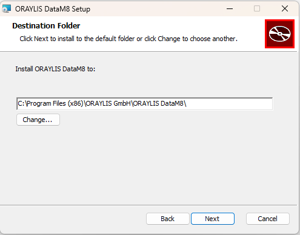
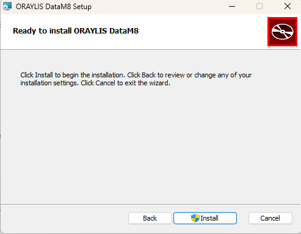
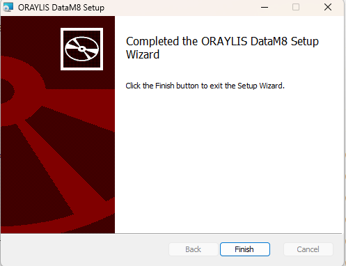

# _DataM8_ Installation Guide

The purpose of the provided instructions is to guide users through the process of installing software on a Windows system, particularly when the software is distributed as an .msi file or as a portable .exe file. 

### Installation .msi
Installing an MSI file on Windows is usually a straightforward process. Here is a step-by-step guide:

1. **Acquire the MSI File:**
   Make sure you have the MSI file you want to install on your computer.

2. **Double-Click the MSI File:**
   Usually, you can initiate the installation by double-clicking the MSI file. This opens the installation wizard.

3. **Welcome Screen:**
   After double-clicking the MSI file, a welcome screen should appear. Read any information or instructions on this screen carefully.
   

4. **License Agreement:**
   Accept the license agreement if prompted. This is often a necessary prerequisite to proceed with the installation.
   

5. **Choose Installation Location:**
   The installation wizard will likely ask you for the destination folder for the installation. A suitable folder is usually proposed by default. You can change this folder if desired.
    

6. **Installation Process:**
   Start the installation process by clicking "Install" or a similar button. The wizard will now begin copying files and configuring the software on your computer.
   

7. **Completion of Installation:**
   After the installation is complete, you may receive a message confirming the successful completion. You might also have the option to launch the application immediately.
   

8. **Verify the Installation:**
   After installation, check if the application functions properly. Open it and ensure everything is running as expected.

9. **Done!**
   Congratulations, you have successfully installed the MSI file.

### Portable .exe

Using a portable .exe file is typically uncomplicated as it does not require installation.

1. **Acquire the Portable .exe File:**
   Make sure you have the portable .exe file on your computer.

2. **Extract Zip:**
   Extracting files on Windows can be done in various ways depending on the file type and compression format. Here are instructions for two commonly used methods: Extracting ZIP archives and unpacking compressed files using the built-in Windows Explorer.

3. **Choose Location:**
   Specify where on your computer you want to store the portable .exe file. This could be, for example, on the desktop or in a specific folder.

4. **Double-Click the .exe File:**
   Launch the application by double-clicking the .exe file. In most cases, the application will start without additional steps.

5. **Use the Application:**
   After launching the application, you can use it normally. This could involve working with a software application, playing a game, or running another type of program.

6. **Close the Application:**
   Close the application when finished by using the application's menu or the "X" icon in the top right corner of the application window.

#### Extract Zip
##### Method 1: Extracting ZIP Archives

1. **Right-Click on the ZIP Archive:**
   - Navigate to the directory containing the ZIP archive.
   - Right-click on the ZIP archive you want to extract.

2. **Choose "Extract All":**
   - In the context menu, you will see the option "Extract All." Click on it.

3. **Select Destination Folder:**
   - A dialog box will open. Choose the folder where you want to save the extracted files.

4. **Extract the Files:**
   - Click "Extract" to start the process.

##### Method 2: Using Windows Explorer

1. **Navigate to the Archive:**
   - Go to the folder containing the compressed archive.

2. **Open the Archive:**
   - Double-click on the ZIP archive. Windows Explorer opens the archive and displays its contents.

3. **Extract the Files:**
   - Select the files or the entire contents of the archive.
   - Click "Extract" in the Windows Explorer menu or drag the selected files to the destination folder.

4. **Select Destination Folder:**
   - Choose the folder where you want to save the extracted files.

5. **Extract the Files:**
   - Click "Extract" to complete the process.

After these steps, the files should be extracted from the ZIP     archive and saved in the destination folder you selected. Note    that there are other archive formats (e.g., RAR) that may   require special software like WinRAR or 7-Zip.
