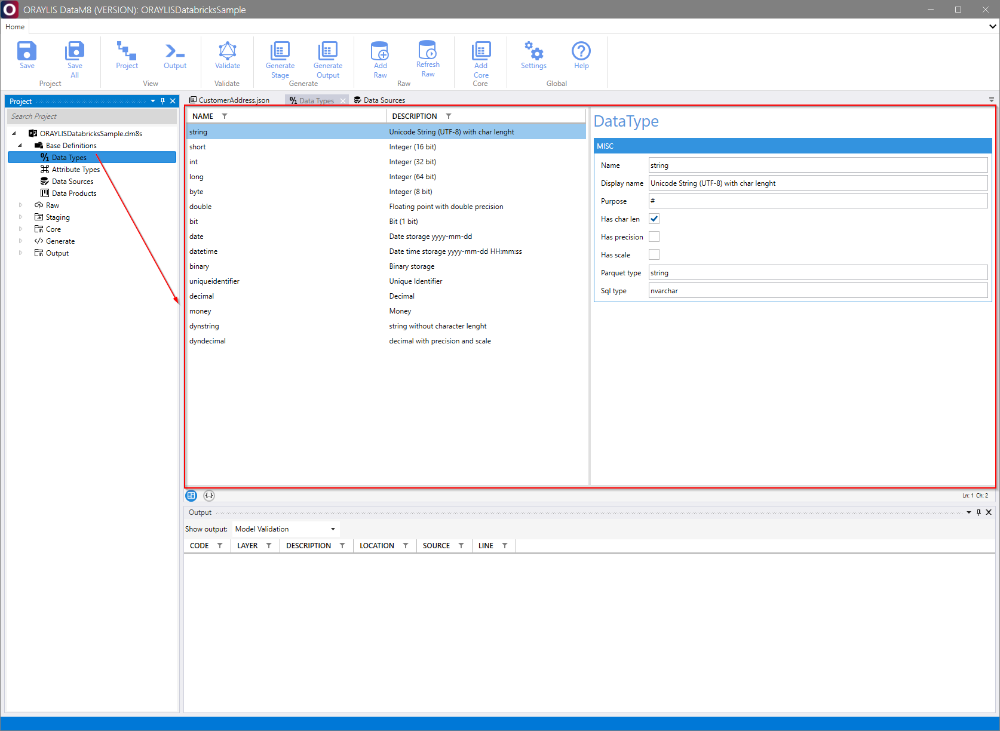
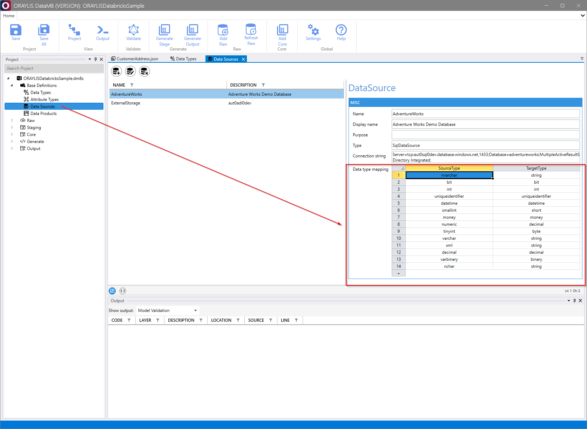
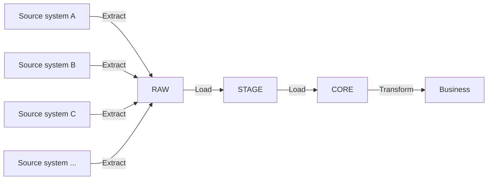

# _DataM8_ Metadata Model Documentation

## Overview

The _DataM8_ metadata model, serialized in JSON, establishes a structured approach to managing and referencing data. It incorporates base definitions and utilizes a unique locator system for maintaining referential integrity, validated by both the _DataM8_ [validator](../validator/validator.md) and the [frontend](../frontend/frontend.md) application.

## Base Definitions

Base Definitions are foundational components in the _DataM8_ architecture, encompassing critical metadata for the configuration of _DataM8_ solutions.

- **Data Sources:** This section defines connection strings and specifies how external data types are mapped to _DataM8_'s internal type system. Supported data sources include:
  1. **[Microsoft SQL Server](https://www.microsoft.com/en-us/sql-server):** A relational database management system.
  2. **[Apache Parquet](https://parquet.apache.org/) on [Azure Data Lake Storage Gen2 (ADLS Gen2)](https://learn.microsoft.com/en-us/azure/storage/blobs/data-lake-storage-introduction):** A column-oriented data file format designed for efficient storage and retrieval of large datasets.
- **Data Types:** This facilitates the translation of external data types to _DataM8_'s internal type system, ensuring seamless data processing across different systems.
- **Attribute Types:** By categorizing column content and enforcing value constraints, _DataM8_ promotes data warehousing best practices. For instance, an "Amount" column might be defined as type "Amt" and represented as a double data type.
- **Data Products:** Organize your data following data mesh principles. Data Products, representing the first hierarchy level within a _DataM8_ project, are followed by Data Modules, which further subdivide data into manageable segments.

## _DataM8_ Data Type System

Understanding _DataM8_'s data type system is crucial for effective database management. The system includes:

### Internal Data Types

These are defined within _DataM8_ and describe the range of data types the system can handle. Attributes such as Name, Display Name, and Purpose are utilized by the [generator](../generator/generator.md) for creating output artifacts.



### External Data Types

These types are specified within external data sources and mapped to the corresponding _DataM8_ internal data types.



## _DataM8_ Locator

The _DataM8_ Locator is an integral tool for identifying and navigating various elements within the metadata model, including data sources, products, modules, and attributes.

Example usage of the _DataM8_ Locator:

```text
"dm8l": "/Stage/Sales/Customer/Customer_DE"

```

## Zones

The data model serialized in JSON using _DataM8_ can be visualized as follows:



The data extraction process begins with different source systems sending data to the **RAW** zone. From there, the data progresses through the **STAGE** zone and eventually reaches the **CORE** zone. Transformations take place in the Business zone currently not being part of _DataM8_.

### RAW

The entry point for source data, the RAW zone maintains data in its original form, ready for further processing. More details are in the RAW Zone 📜[guide](zones/raw.md).

### STAGE

The STAGE zone validates data structure and type. Non-conforming records are moved to a poison table for review. Detailed information is in the STAGE Zone 📜[guide](zones/stage.md).

### CORE

The CORE zone is pivotal, handling business key definitions, applying SCDs, and unifying tables. Extensive information is available in the CORE Zone 📜[guide](zones/core.md).
