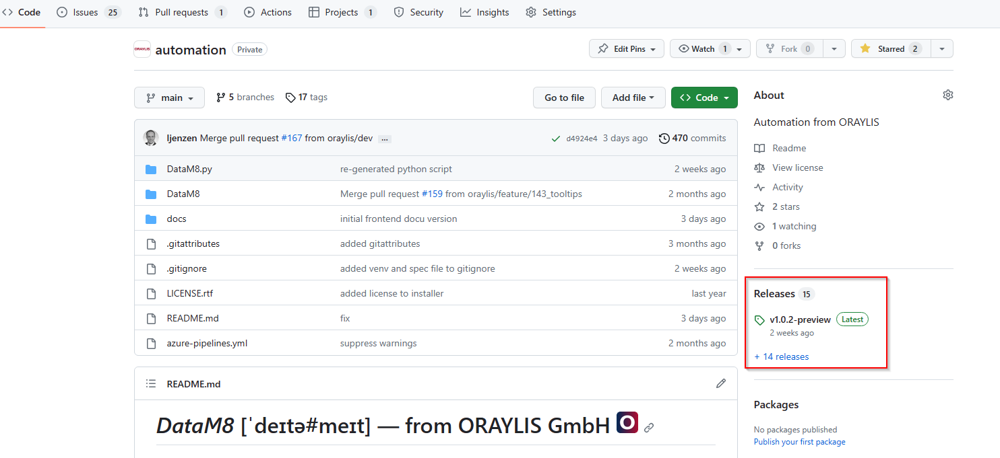
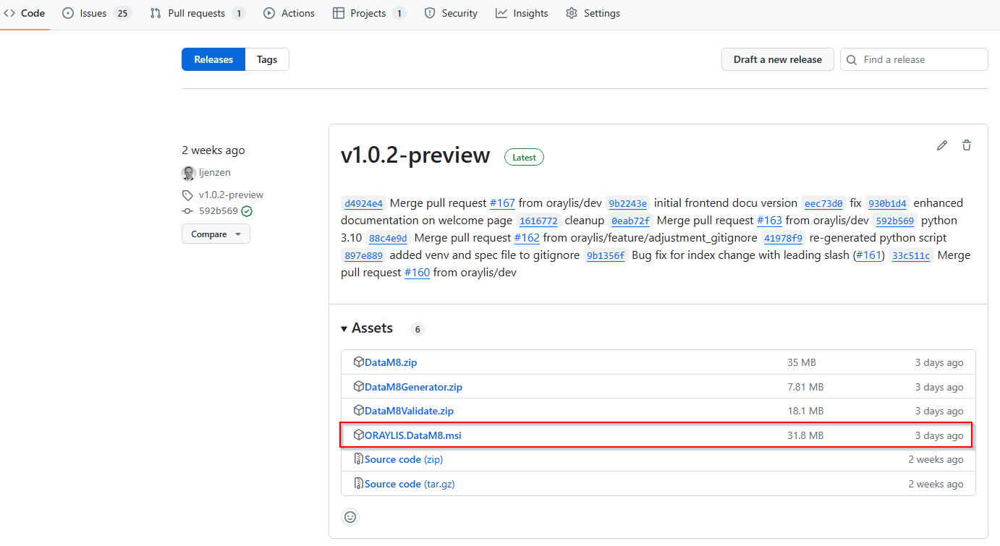
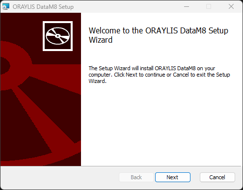
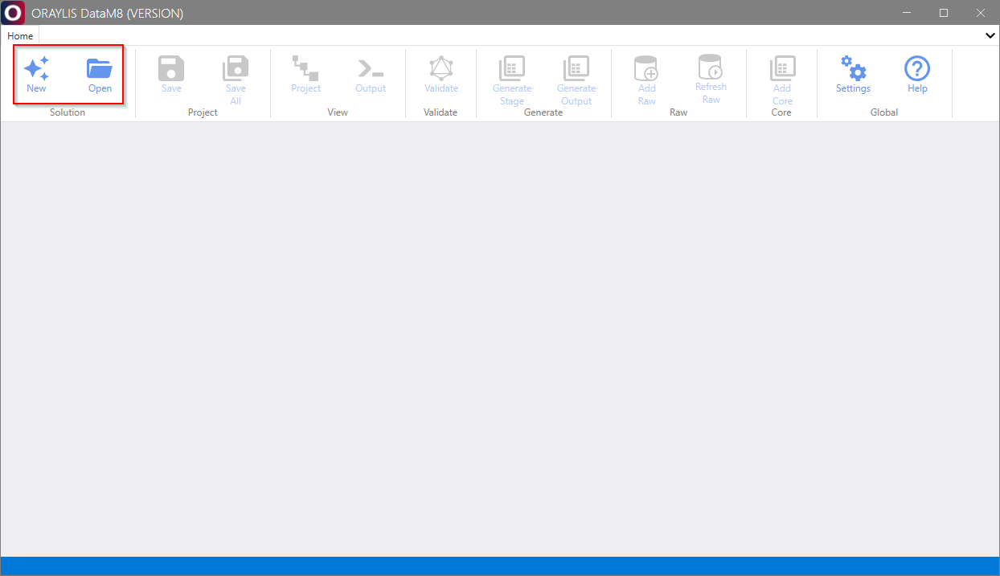
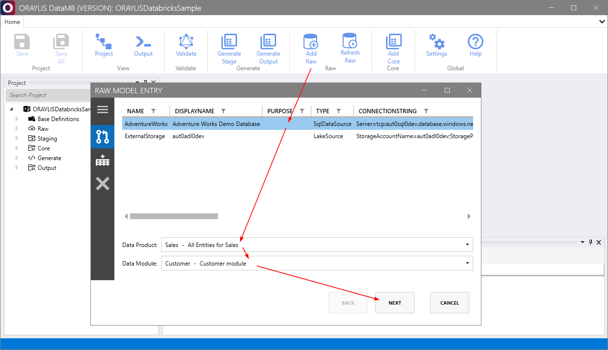
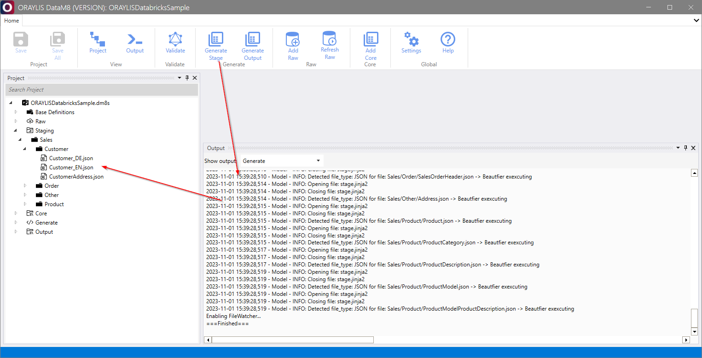
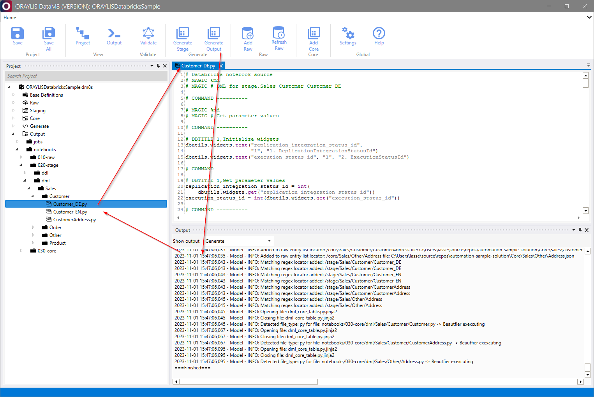

# _DataM8_ Quick Start Guide

_DataM8_ is an exceptional open-source data automation tool that streamlines the setup of data warehouses on various platforms. This comprehensive quick start guide will walk you through the main steps to get started with _DataM8_ and unleash its powerful features for automating data warehouse workflows.

## Roles within _DataM8_

### Data Model Developer
- **Interests:** Raw, Staging, Core, and Output
- **Tasks:** Involved in the data modeling and transformation process. Adding new Raw entities from existing source systems, staging the data, and creating Core models. Defining entity attributes, relationships, and applying custom transformations to streamline data processing.

### Automation Developer
- **Interests:** Base Definitions and Generate/Templates.
- **Tasks:** Automating data warehouse workflows on your preferred target platform. Leveraging _DataM8_'s Base Definitions and Generate/Templates features to create reusable templates and automate various data engineering tasks.

### Automation Tool Developer
- **Interests:** Advanced debugging, beta features, and compiling the tool.
- **Tasks:** Focusing on advanced debugging, testing beta features, and contributing to the enhancement of _DataM8_. Compiling the tool with custom modifications when needed.

Each role in _DataM8_ contributes to the overall efficiency and quality of data platform setup and maintenance. Whether you are an Automation Developer streamlining data workflows, a Developer modeling and transforming data, or an Automation Tool Developer extending _DataM8_'s capabilities, the tool provides a comprehensive platform to meet your data engineering needs effectively.

## Quick Start Guide for Automation Developers and Developers

### Step 1: Installation

1. Download the [latest release](https://github.com/oraylis/automation/releases) of _DataM8_ from the GitHub Releases page.  
2. Install _DataM8_ by running the downloaded MSI installer and following the installation wizard. Ensure to accept the license and to select the correct installation path. 

Please find comprehensive instructions for installation and portable usage [here](./installation.md).

### Step 2: Project Setup

1. Launch _DataM8_ by opening the application.
2. Load your _DataM8_ solution or create a new one using the [Open](../frontend/frontend.md#open) or [New](../frontend/frontend.md#new) within the [Solution Group](../frontend/dialogues/group-solution.md). 

 

### Step 3: Working with Raw and Stage Entities - Data Model Developer Tasks

#### Adding a New [Raw](../metadatamodel/zones/raw.md#entity-definition) Entity

1. Click on "Add Raw" and select the source system (e.g., AdventureWorks).
2. Categorize the data by specifying the Data Product and Module.
3. Choose the entity you want to add and click "Add."
4. Optionally, you can add a custom SQL query for the entity (if implemented).

#### [Generating](../generator/generator.md) the [Stage](../metadatamodel/zones/stage.md#entity-definition)

1. Ensure that the Stage generation settings are correctly configured in the settings.
2. Click on the "Generate Stage" button to create the Stage from the [Raw](../metadatamodel/zones/raw.md#entity-definition) entity.

### Step 4: Automation Developer Tasks

As an Automation Developer, you can leverage Base Definitions and Generate/Templates features to automate data warehouse workflows on your preferred target platform.

### Step 5: Working with [Core](../metadatamodel/zones/core.md#entity-definition) Entities - Data Model Developer Tasks

1. Add a new Core entity and define its display name, explanation, purpose, tags, and parameters (key/value store).
2. Union multiple entities from the Stage to create the Core entity.
3. Include or exclude columns as needed for the Core entity.
4. Set target names, business keys, attribute types, data types (from Base Definitions), and unit attribute names for the included columns.
5. Add computed columns that use SQL to compute values on a column level.
6. Establish relationships to other Core entities for better documentation or generation of SK columns (if applicable).
7. Apply filtering to the Core entity as necessary.

### Step 6: [Generating](../generator/generator.md) Code

1. After maintaining the Core entity, generate DDL/DML and potentially ETL/Orchestration jobs based on the defined Raw, Stage, and Core entity definitions.
2. Generate output using the Jinja2-templates.

Now, you are ready to harness the full power of _DataM8_ for your data engineering projects. For more in-depth insights and advanced features, refer to the complete _DataM8_ 📜[guide](../DataM8.md).

## Any questions?

If you encounter any issues or have questions, please don't hesitate to reach out for support.
